# ☕ CreatorSpace

**🌐 Live:** [creator-space-zeta.vercel.app](https://creator-space-zeta.vercel.app)

A full-stack creator support platform where fans can back their favourite creators instantly — no complicated setups, no hidden fees.

---

## 🚀 Why CreatorSpace?

CreatorSpace was built with one goal in mind — give every creator a dead-simple way to receive support from the people who love their work.

This project focuses on:

* ✅ Clean component structure
* ✅ Professional Git commit practices
* ✅ Responsive UI on all devices
* ✅ Real-world backend integration
* ✅ Production deployment

---

## ✨ Features

* 🔐 GitHub & Google OAuth login via NextAuth
* 👤 Creator profile pages with cover & profile photos
* 💸 Razorpay payment integration
* 🧾 Payment history & supporter list
* ⚙️ Creator dashboard to manage profile & payment settings
* 📱 Fully responsive UI (mobile + desktop)
* 🗄️ MongoDB Atlas database (cloud-hosted)
* 🚀 Deployed on Vercel

---

## 📸 Screenshots

### 🏠 Home
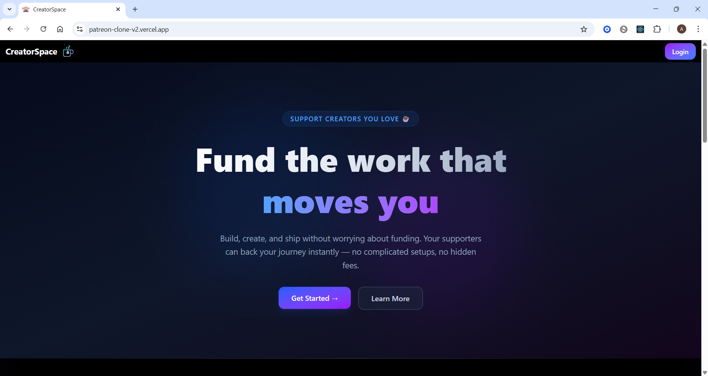
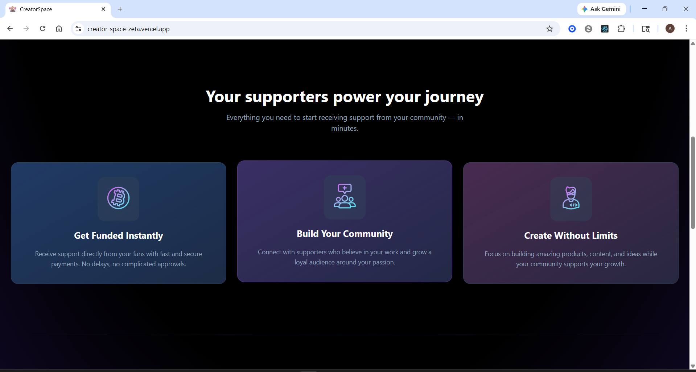
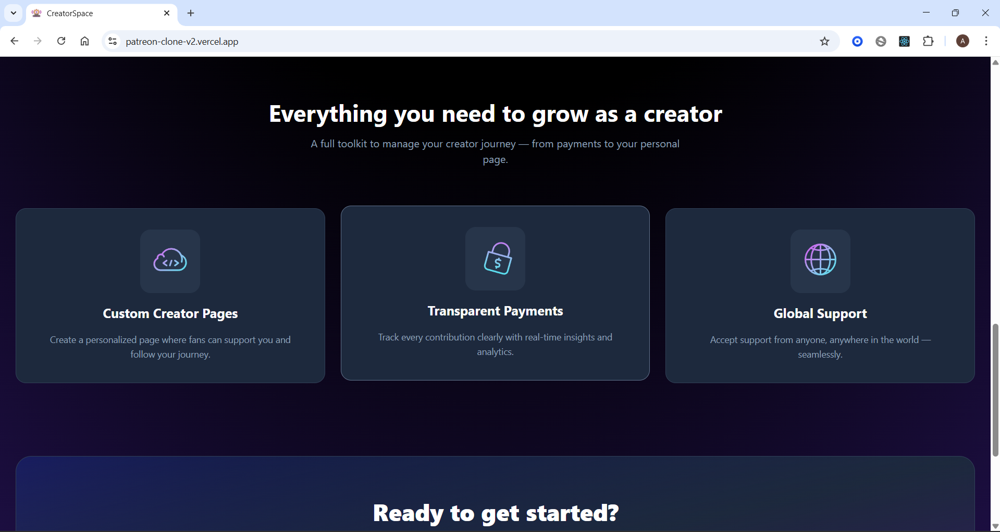
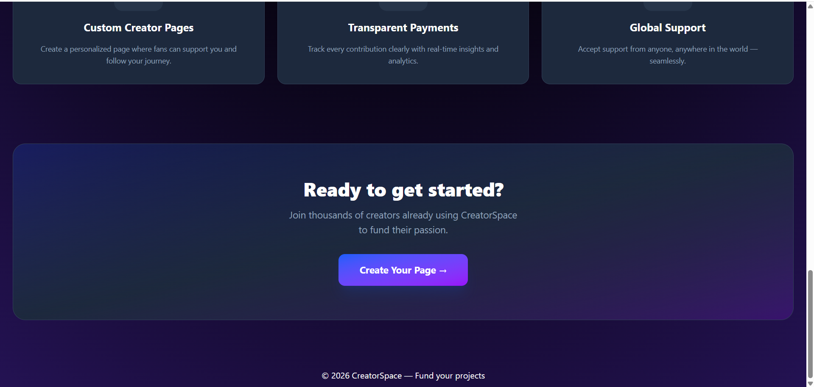

### 👤 Creator Profile
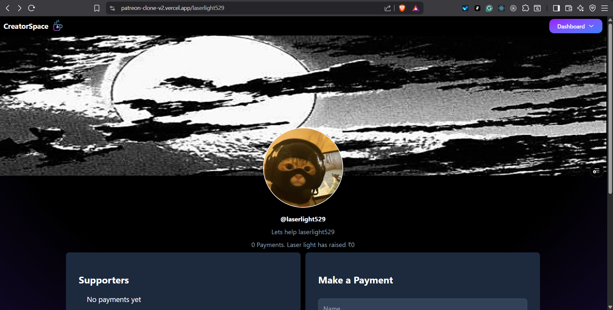
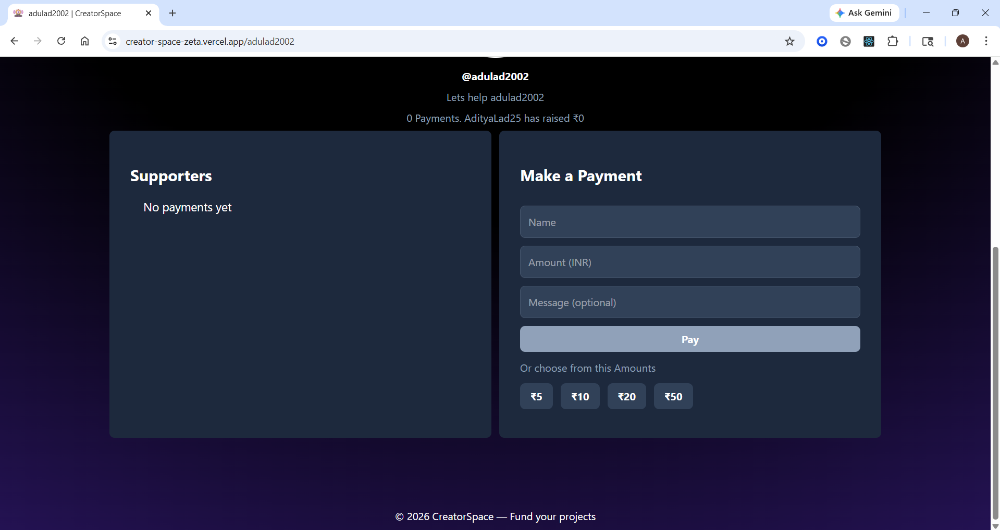

### ⚙️ Dashboard
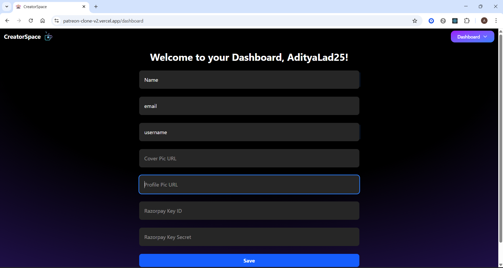

### 📖 About
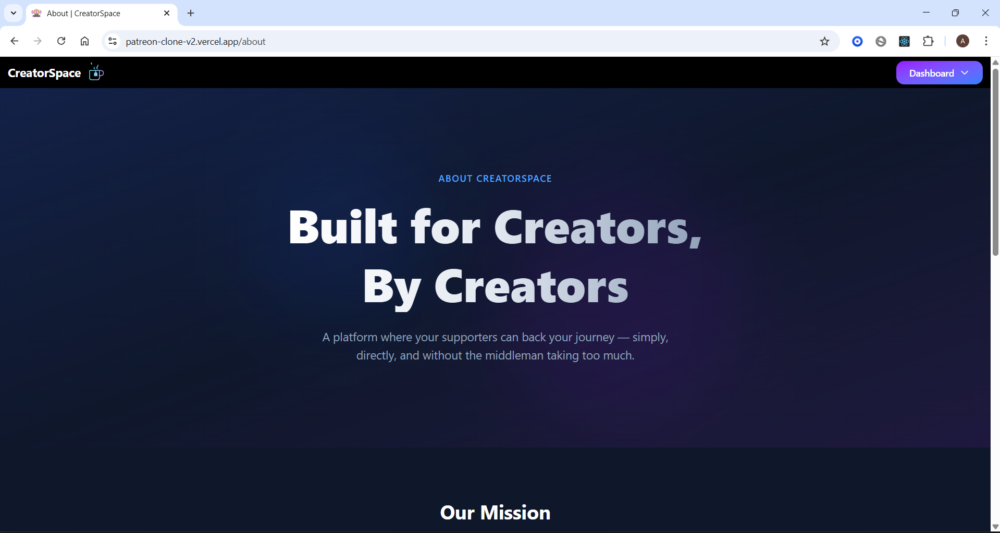
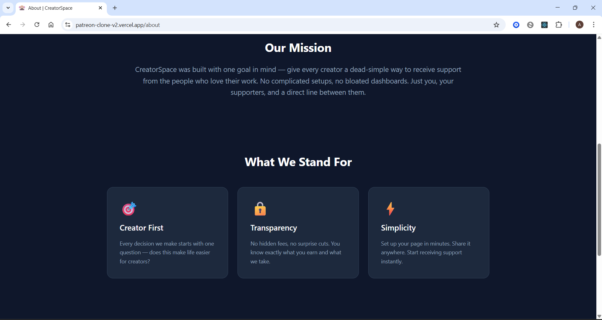
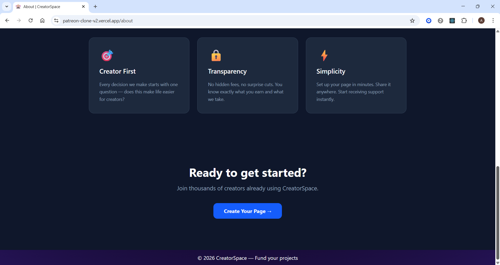

### 🔐 Login
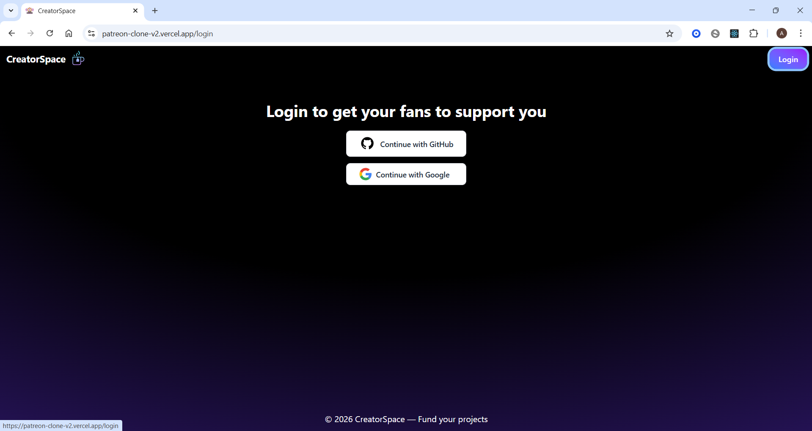

---

## 🧱 Tech Stack

| Layer | Technology | Version |
|-------|-----------|---------|
| Framework | Next.js (App Router) | 16.1.4 |
| Frontend | React | 19.2.3 |
| Styling | Tailwind CSS | 4 |
| Auth | NextAuth.js (GitHub, Google) | 4.24.13 |
| Database | MongoDB + Mongoose | 9.2.1 |
| Payments | Razorpay | 2.9.6 |
| Notifications | React Toastify | 11.0.5 |
| Hosting | Vercel | — |
| DB Hosting | MongoDB Atlas | — |

---

## 📦 Installation

```bash
# Clone the repo
git clone https://github.com/your-username/creatorspace.git
cd creatorspace

# Install dependencies
npm install

# Set up environment variables
cp .env.example .env.local
# Fill in your values in .env.local

# Run the development server
npm run dev
```

---

## 🔑 Environment Variables

Create a `.env.local` file in the root with the following:

```env
GITHUB_ID=
GITHUB_SECRET=

GOOGLE_CLIENT_ID=
GOOGLE_CLIENT_SECRET=

NEXTAUTH_URL=http://localhost:3000
NEXTAUTH_SECRET=

NEXT_PUBLIC_URL=http://localhost:3000

MONGODB_URI=

NEXT_PUBLIC_KEY_ID=
KEY_ID=
KEY_SECRET=
```

---

## 🧪 Development Philosophy

* Small, meaningful commits
* No copy-paste development
* Code readability over shortcuts
* Mobile-first responsiveness
* Incremental feature delivery
* Long-term maintainability

---

## 👤 Author

**Aditya Lad**

---

> This project demonstrates real-world full-stack engineering — from auth and payments to database integration and production deployment.